# 在iOS平台创建awtk应用程序

## 一、创建项目

* 创建一个Single View App

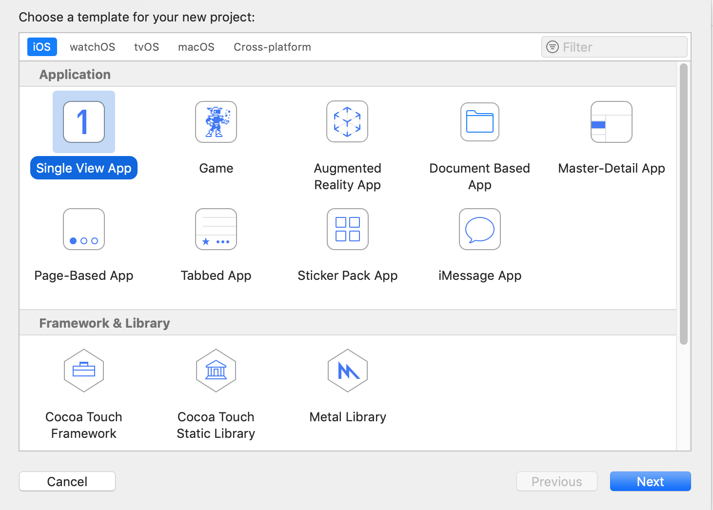

* 设置基本信息(不要选择测试项目)

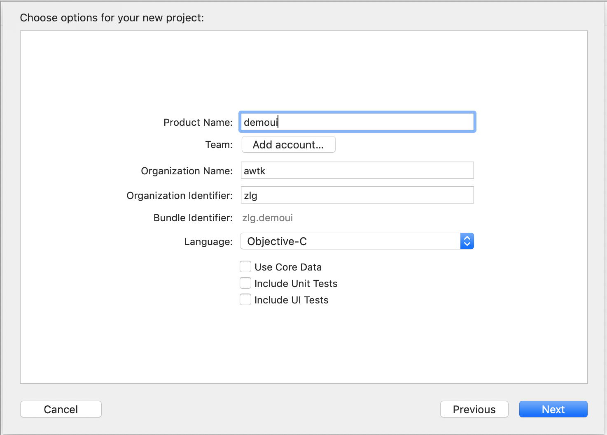

* 删除自动生成的部分文件，并把Main interface设置为空

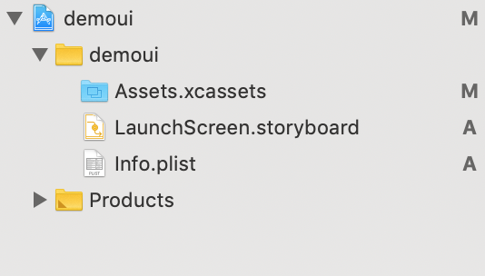

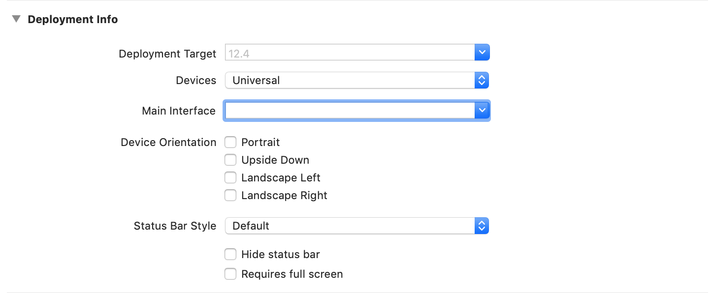

* 从访达中把awtk_ios.xcodeproj和SDL.xcodeproj拖入到项目

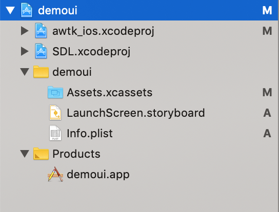

## 二、基本配置

* 添加源文件
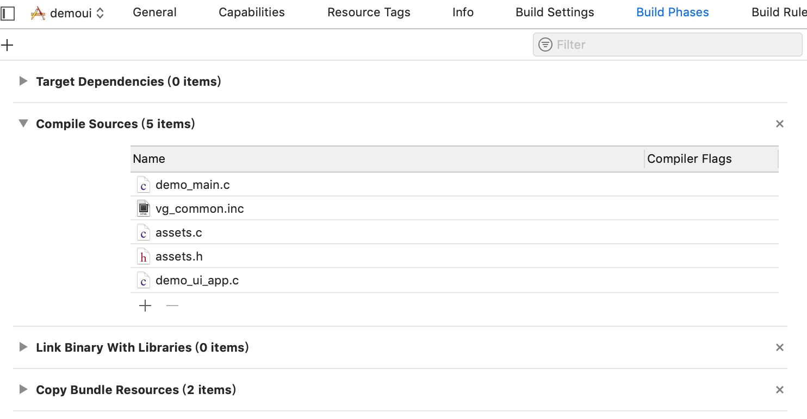

* 设置头文件搜索路径
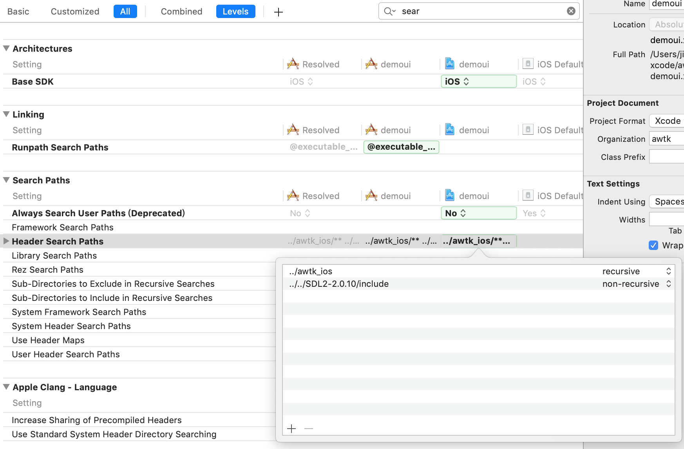

* 定义预处理宏
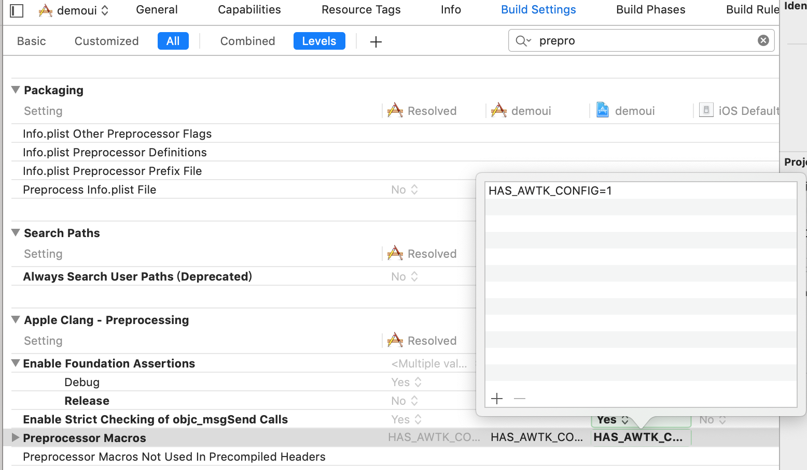

* 增加依赖关系


* 选择链接的库和框架

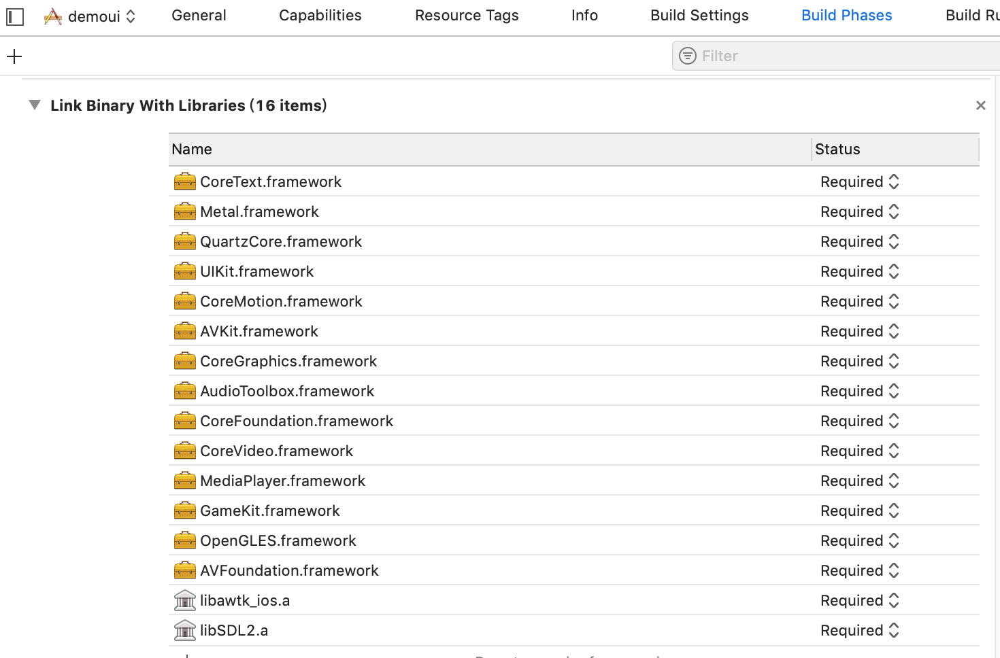

* 增加资源
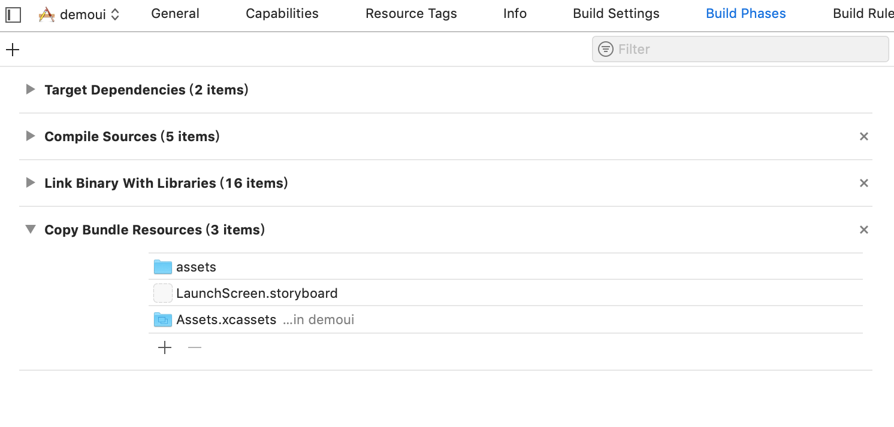

> 需要选择Create folder references

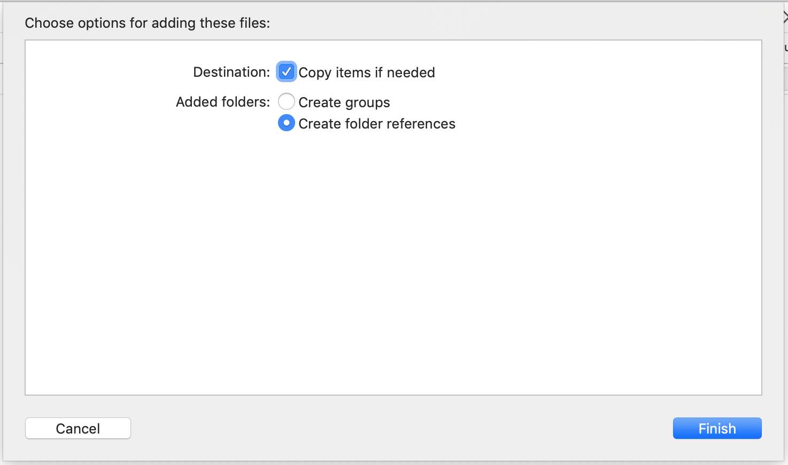

## 三、其它

在主函数之前需要包含一下SDL.h

```c
#elif defined(IOS)
#include <SDL.h>
int main(int argc, char* argv[]) {
  int32_t lcd_w = 0;
  int32_t lcd_h = 0;
  tk_init(lcd_w, lcd_h, APP_MOBILE, "", "");
  system_info_set_default_font(system_info(), "default_full");
```
  
## 四、真机调试

* [Xcode9 无证书真机调试](https://blog.csdn.net/zhenggaoxing/article/details/79042382)

* [真机调试或打包问题解决办法](https://juejin.im/post/5d1c6b2051882541fc2e096e)

