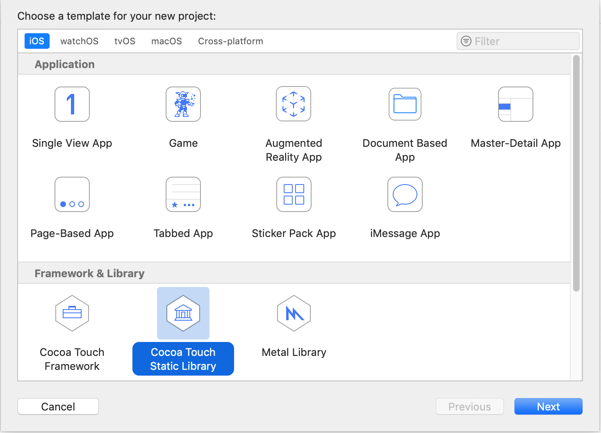
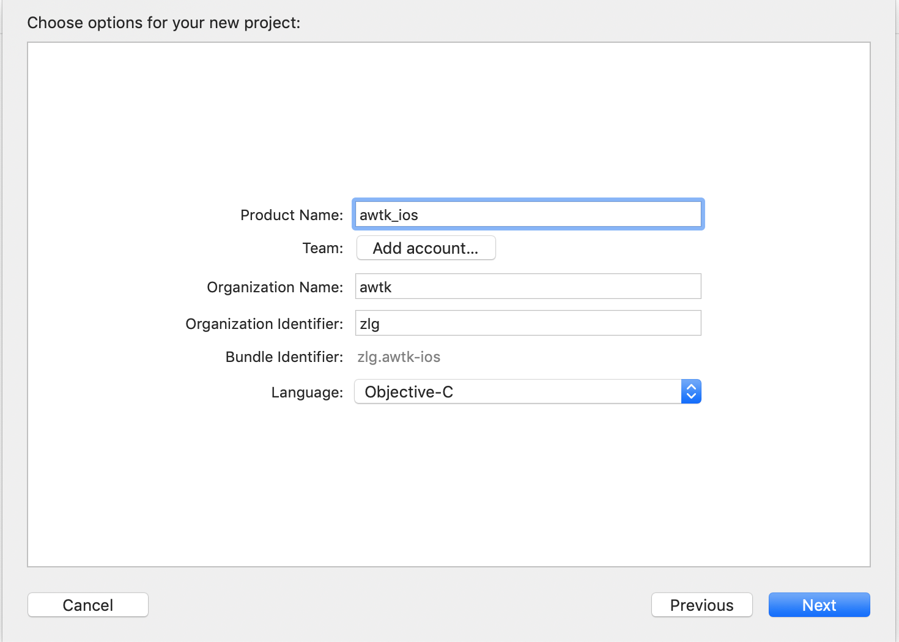
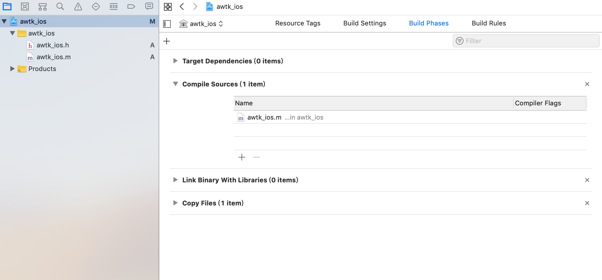
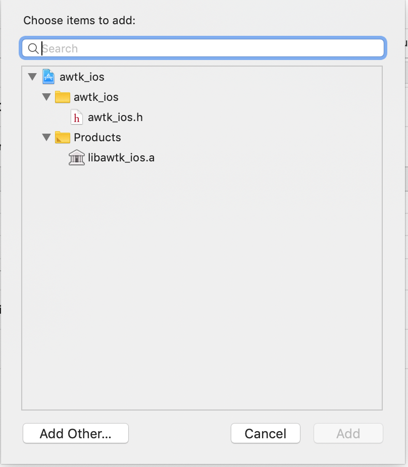
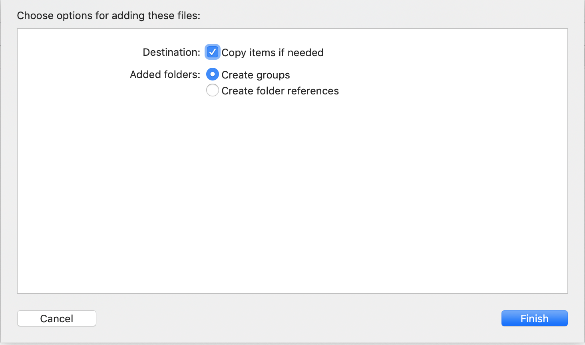
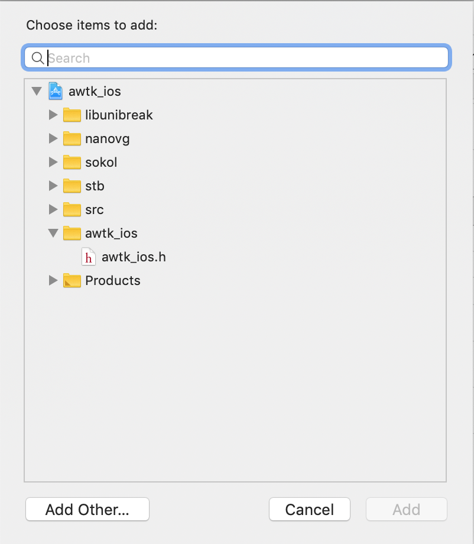
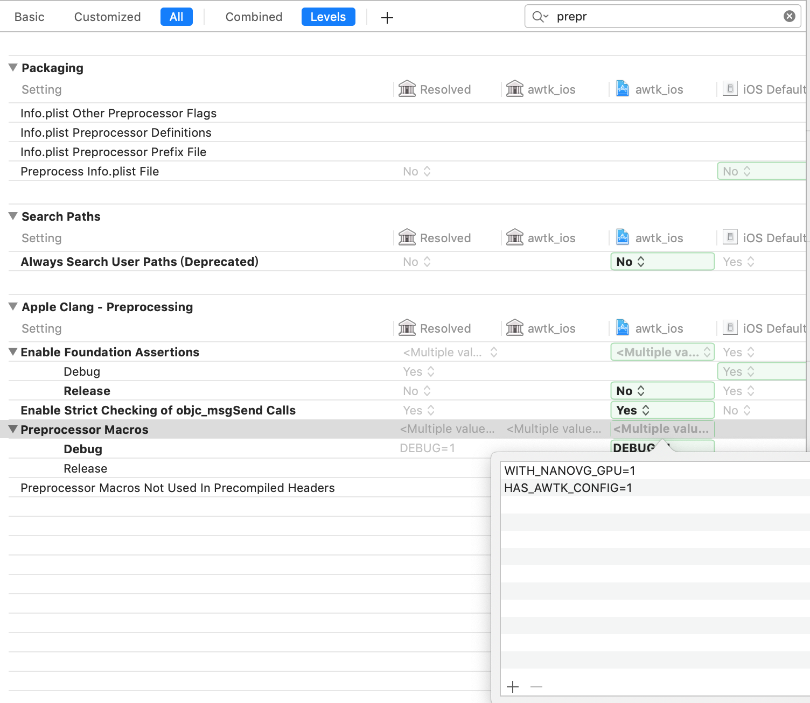
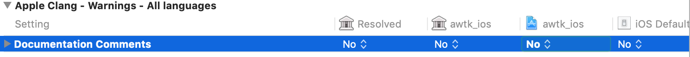

# 用Xcode 编译iOS版本AWTK

## 一、创建项目

* 创建Cocoa Touch Static Library项目



* 语言选择Objective-C



## 二、实现log函数

>awtk_ios.m

```c
void awtk_ios_log(const char *message,...)
{
    va_list args;
    va_start(args, message);
    NSLog(@"%@",[[NSString alloc] initWithFormat:[NSString stringWithUTF8String:message] arguments:args]);
    va_end(args);
}
```

>log.h

```c
#elif defined(IOS)
void awtk_ios_log(const char* message, ...);
#define log_debug(format, args...) \
  if (log_get_log_level() <= LOG_LEVEL_DEBUG) awtk_ios_log(format, ##args)
#define log_info(format, args...) \
  if (log_get_log_level() <= LOG_LEVEL_INFO) awtk_ios_log(format, ##args)
#define log_warn(format, args...) \
  if (log_get_log_level() <= LOG_LEVEL_WARN) awtk_ios_log(format, ##args)
#define log_error(format, args...) \
  if (log_get_log_level() <= LOG_LEVEL_ERROR) awtk_ios_log(format, ##args)
```

## 三、增加awtk文件











## 四、定义预处理宏


## 五、指定头文件搜索路径



## 六、配置文件

> 请参考 awtk_config.h
